# VR Safety Training Explorer

Civil/construction engineering learning objectives, assessment evidence, and the three calculation-based Construction decisions are documented in [docs/CIVIL_ENGINEERING_LEARNING_DESIGN.md](docs/CIVIL_ENGINEERING_LEARNING_DESIGN.md).

## Civil engineering learning evidence

| Explicit objective board | Formwork demand/capacity decision |
| --- | --- |
| 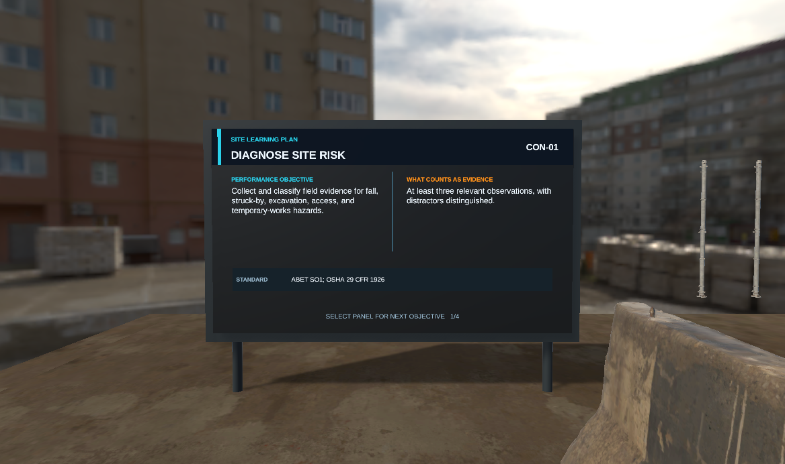 | 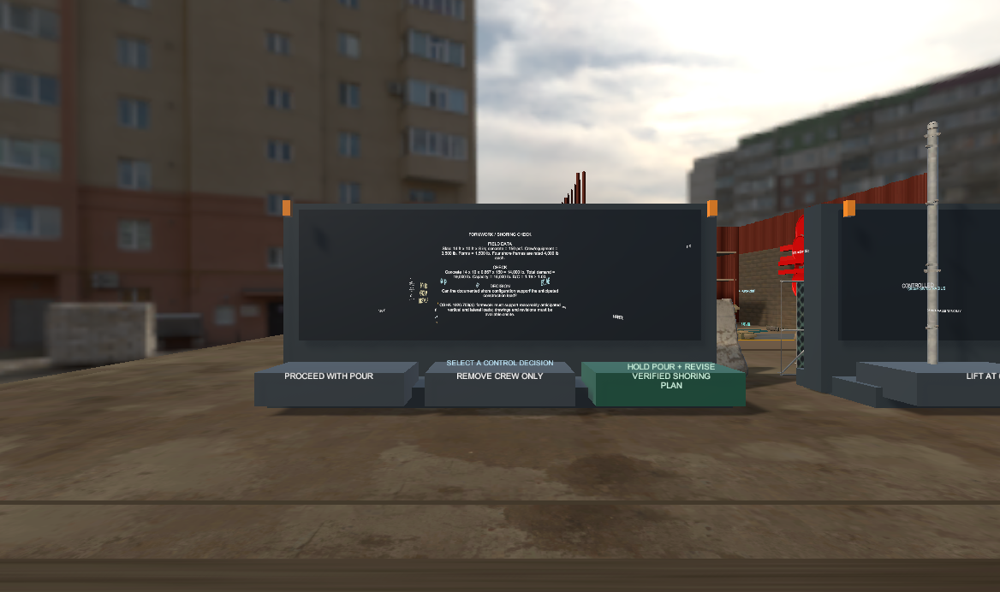 |

| Diagnostic feedback after an unsafe choice | Verified decision with HUD evidence update |
| --- | --- |
| 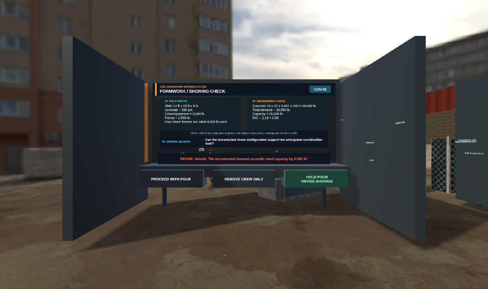 |  |

Unity 6 + OpenXR prototype for exploring multiple safety-training sites and talking with Microsoft Rocketbox NPCs. The experience contains five workplace zones in one continuous campus:

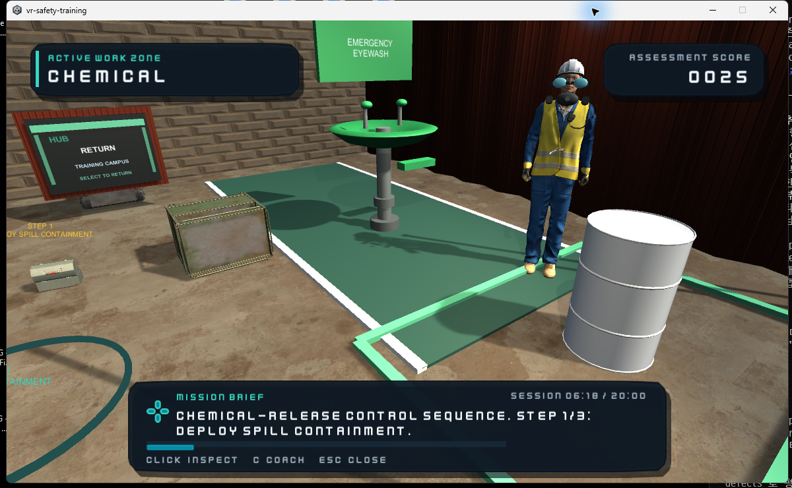

## Training mechanics at a glance

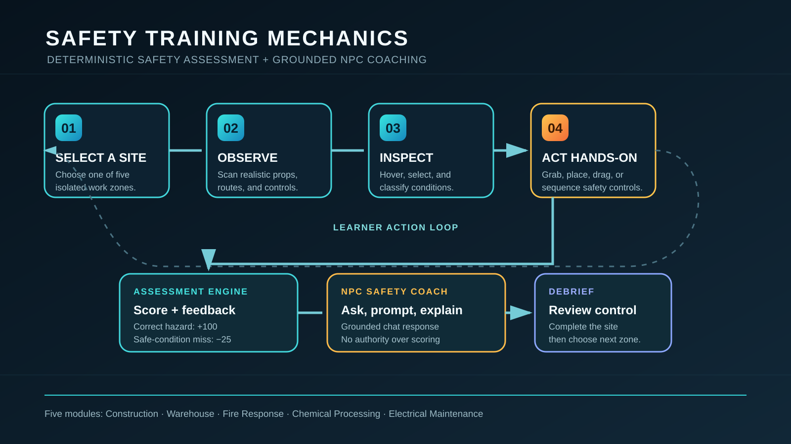

The assessment engine owns hazards, action order, completion, and scoring. The NPC coach provides grounded, role-aware explanations and natural chat interaction without changing the deterministic training outcome.

## In-game documentation captures

| Training hub | Electrical safety coach |
| --- | --- |
| 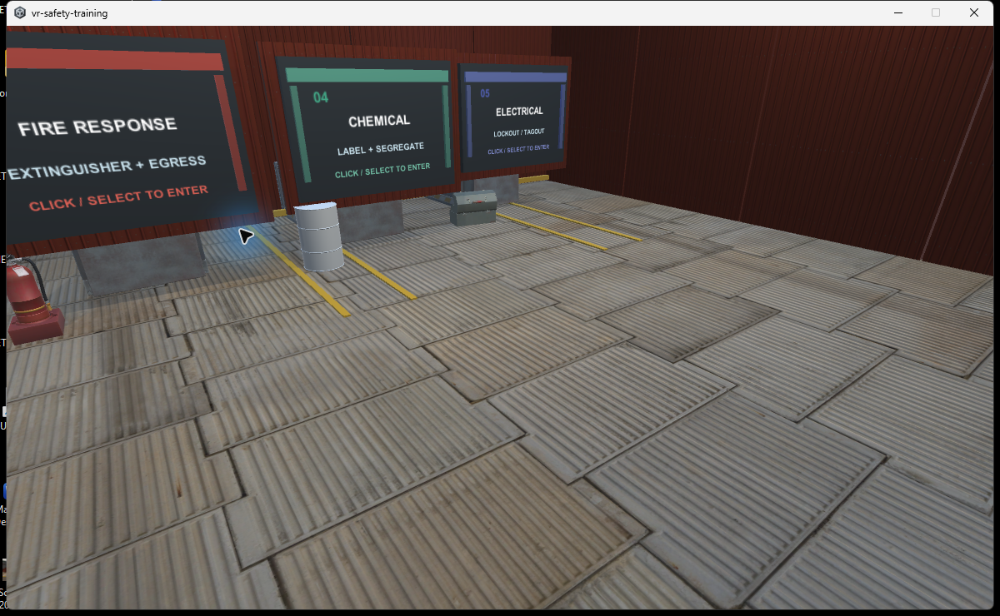 | 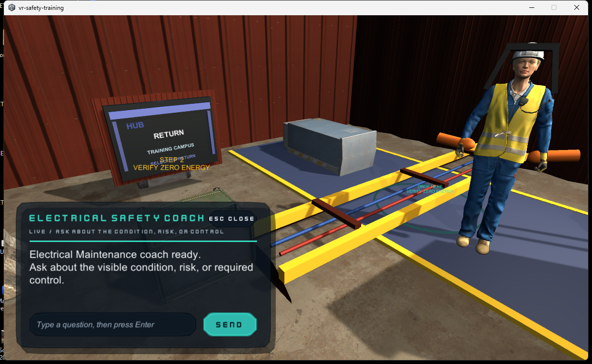 |

### Current five-site pilot capture

| Hub | Construction | Warehouse |
| --- | --- | --- |
| 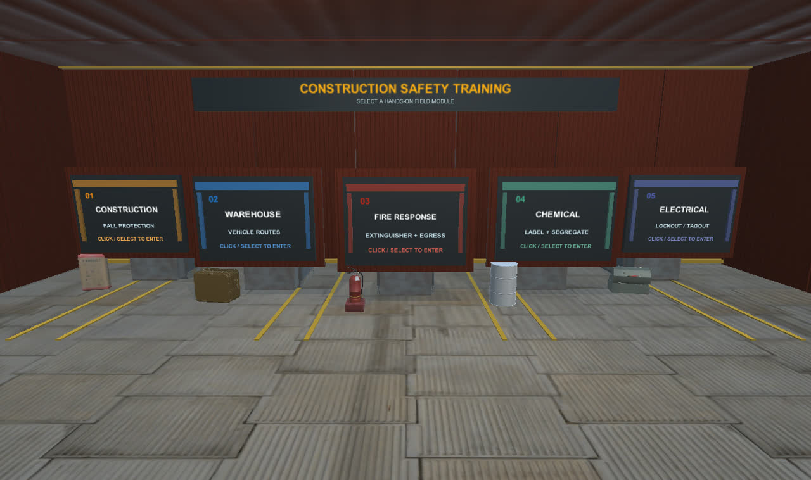 | 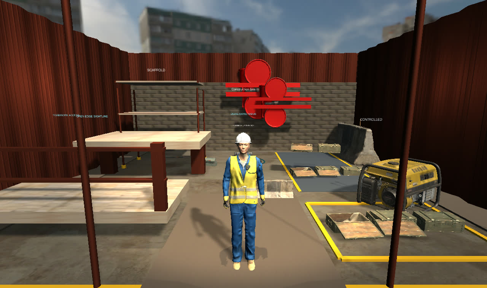 | 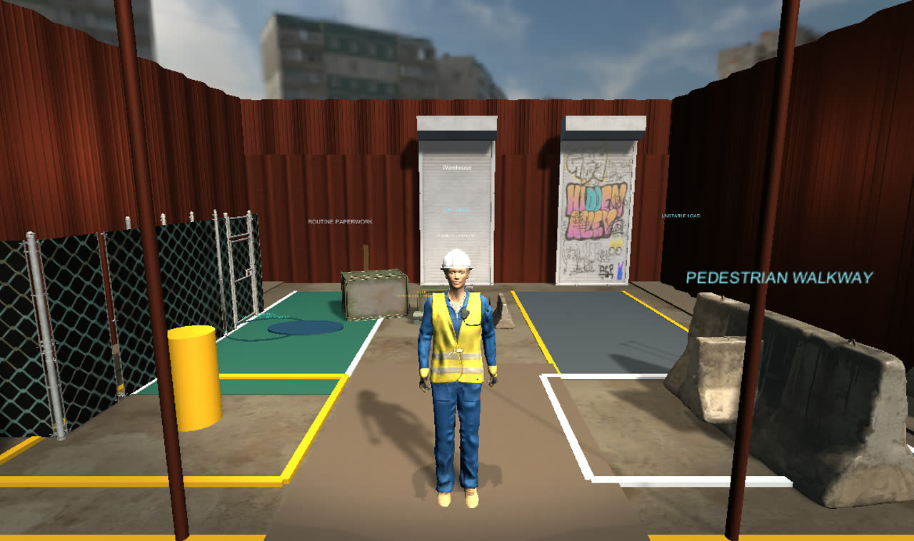 |

| Fire response | Chemical processing | Electrical maintenance |
| --- | --- | --- |
| 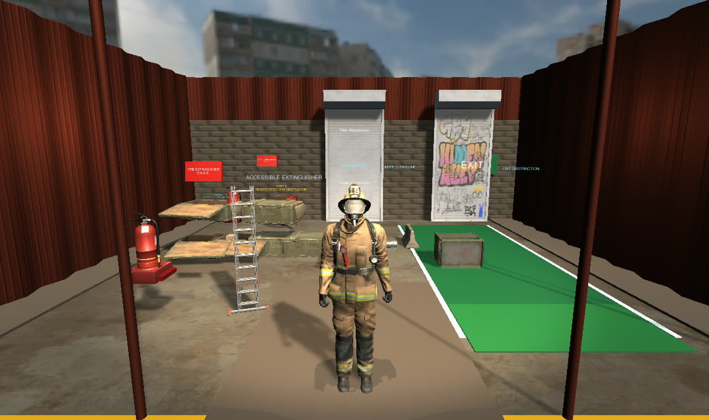 | 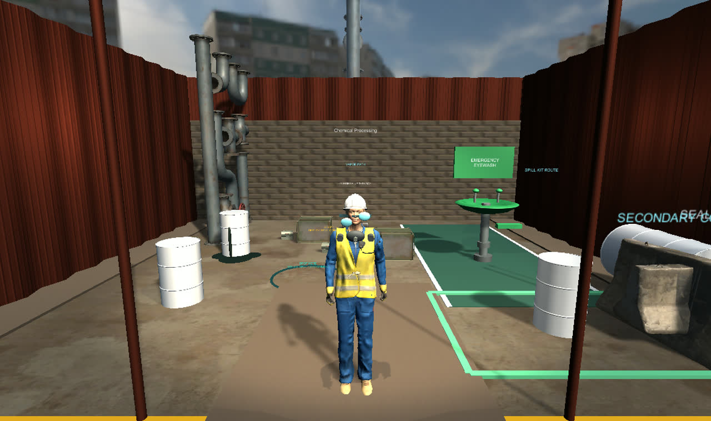 | 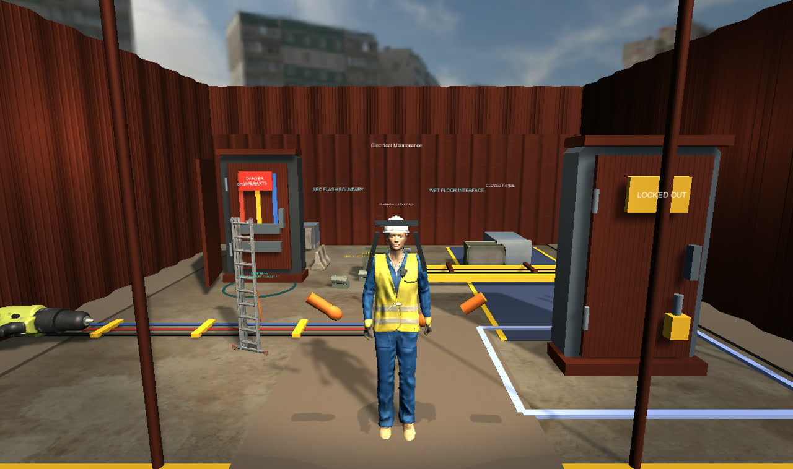 |

[Watch the compressed pilot walkthrough](docs/media/VR-Safety-Pilot-Demo.mp4). The detailed engineering and OSHA-readiness evidence is in [the demo pilot validation report](docs/PILOT_VALIDATION_REPORT.md).

- Construction: fall protection and blocked-access hazards
- Warehouse: spill and vehicle-route hazards
- Fire response: extinguisher access and evacuation hazards
- Chemical processing: solvent storage, labeling, and eyewash access
- Electrical maintenance: energized-panel lockout and protected cable crossings

Each site contains two real hazards and two controlled look-alikes. Nothing is labeled or colored as a hazard before inspection. A correct identification earns 100 points; the first selection of a safe condition costs 25 points; repeats do not change the score. The deterministic training engine owns completion and scoring. The language model only produces grounded NPC coaching, so a model response cannot change the correct answer or score.

Five bright route lanes and portal pads move the learner across a continuous walkable ground plane; each site can also be entered directly through its portal. A startup grounding guard prevents the XR rig from dropping before locomotion is initialized. Each Rocketbox coach cycles through inspection guidance, progress-aware hints, control explanations, and a score-neutral debrief. Inspection events are written as JSONL under Unity's persistent data folder without learner identity or raw conversation text.

## Run the completed prototype

Run `Builds/Windows/VR-Safety-Training.exe`, or open this folder with Unity `6000.0.75f1` and play `Assets/SafetyTraining/Scenes/SafetyTrainingExplorer.unity`. The generated scene already contains the XR Origin, controller interaction, five sites, HUD, portals, hazards, evidence objects, spatial-analytics zones, hands-on tasks, and Rocketbox coaches. `Safety Training > Build Prototype Scene` regenerates it.

The scene supports WASD movement, right-mouse look, and mouse selection as a desktop fallback. In VR, inspection targets, coaches, and site portals use `XRSimpleInteractable` selection. Green and amber colors appear only after a learner makes a selection. The HUD uses a compact dark field-ops panel with site header, score, and wrapped feedback text.

The lobby includes a `DESKTOP / IVR` experience toggle. On Windows, IVR starts when Meta Quest Link (or another OpenXR runtime) is available; otherwise the learner remains in desktop mode with an actionable status message. A Quest standalone build always selects IVR. Use `Safety Training > Build Meta Quest APK` after installing Unity Android Build Support, Android SDK/NDK Tools, and OpenJDK.

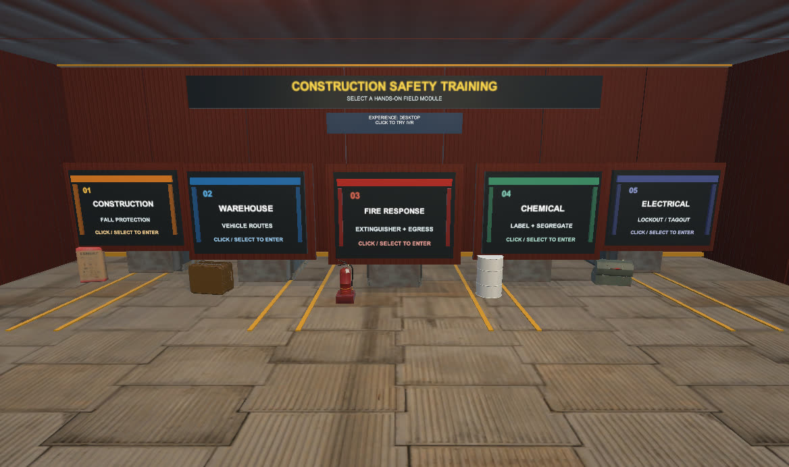

The validated standalone APK is at `Builds/MetaQuest/VR-Safety-Training-QuestPro-EyeGaze-Cloud-2026-07-20.apk` (95.0 MB). Quest Pro automatically uses OpenXR eye gaze when the learner grants access; Quest 3 and 3S automatically use head-gaze fallback in the same APK. See [Meta Quest deployment and QA](docs/META_QUEST.md) for installation, privacy-minimized gaze analytics, and the remaining physical-headset checks.

Cloud analytics are local-first and connected to the live Cloudflare research collector. Pseudonymous spatial, interaction, `eye_gaze`, and `head_gaze_fallback` events retry from an on-device queue and are stored in D1 without embedding Cloudflare credentials in the APK. See [Cloudflare analytics connection](docs/CLOUD_ANALYTICS.md).

## Construction practical

Construction Site is the hands-on lead scenario. Students complete a deliberately ordered five-step control loop by grabbing marked props with an XR controller (or clicking them in desktop fallback): pick up the PPE kit, set the exclusion barricade, install the guardrail kit, move the material cart to staging, and complete the final walkdown with the clipboard. Out-of-order actions produce an immediate HUD sequence cue; completed actions turn green and award a 20-point practical bonus. The sequence is repeat-safe and ends with a coach debrief prompt.

The construction pass uses authored multi-part model assemblies rather than single placeholder blocks: scaffold uprights/crossbars/decks/base jacks, PPE case contents and latch, barricade feet/posts/striping, rail-kit base plates/uprights, cart handle/wheels, and clipboard clip.

The site is also dressed with downloaded Poly Haven CC0 assets: a hand truck, sectioned ladder, cement bag, drill, and industrial barrel. Source attribution and local files are tracked under `Assets/ThirdParty/PolyHaven/`.

## Blender-authored US site asset pack

The five training modules now include 15 individually modeled, texture-light US workplace props. Construction uses modular formwork, capped rebar, and an adjustable shoring rack; Warehouse uses an electric forklift, selective pallet rack, and dock leveler; Fire Response uses an upright ABC extinguisher with an integrated English `ABC / P.A.S.S.` label, hose cabinet, and crash-bar exit door; Chemical Processing uses an IBC tote, eyewash/shower, and flammable-liquid cabinet; Electrical Maintenance uses a NEMA panel, lockout/tagout station, and safety disconnect.

| All Blender props in their training sites | NPC idle, walking, gesture, and settled QA |
| --- | --- |
| 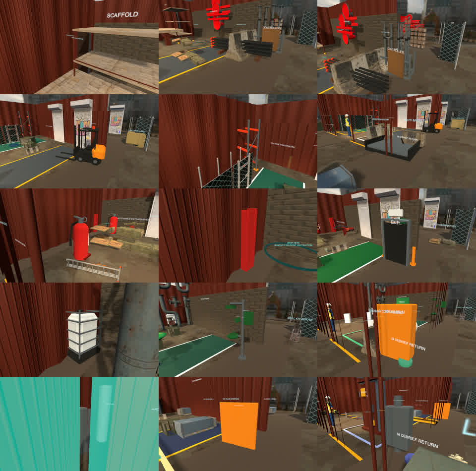 | 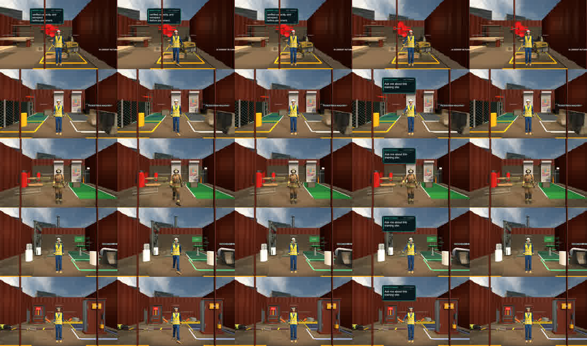 |

Editable Blender sources are under `SourceAssets/Blender/`; reproducible generators are under `Tools/Blender/`; the five generated modeling-reference sheets are under `docs/design/`. Imported FBX files disable animation, cameras, lights, and readability, use medium mesh compression, and remain below the per-prop 12,000-triangle Quest budget.

Rocketbox coaches now run an idle behavior loop: subtle body sway/weight shift for generic rigs, timed field-pointing and explanation gestures where humanoid bones are available, head motion during conversation, and a separate talking pose so chat interaction does not snap the NPC back to the default pose.

Environment lighting uses a warm directional sun with soft shadows, site work lights, tri-light ambient color, linear distance fog, a procedural sky, and one baked reflection probe per workplace. The baked probes avoid the GPU/headless instability of realtime cubemap updates while preserving stable VR performance.

Click any Rocketbox coach to open the live chat panel. Students can type a question and press Enter/Send; the coach answers through the configured OpenAI-compatible endpoint, with a grounded offline fallback when the endpoint is unavailable. Conversation context is retained for the active coach, while authored safety facts and deterministic scoring remain authoritative.

## Validation

- Unity EditMode suite: 179/179 passed
- OpenXR Standalone Project Validation: 0 outstanding issues
- OpenXR Meta Quest Android Project Validation: 0 outstanding issues
- Windows standalone build: succeeded at `Builds/Windows/VR-Safety-Training.exe` (163 MB folder)
- Meta Quest standalone APK: succeeded at `Builds/MetaQuest/VR-Safety-Training-QuestPro-EyeGaze-Cloud-2026-07-20.apk` (95.0 MB, ARM64, APK Signature v2)
- Five-site capture tour: hub, overview, real-prop, NPC idle/walk/dialogue, and settled frames generated
- Automated demo pilot: 1,200 simulated seconds, 31 analytics zones, 20 inspections, 31 evidence interactions, 25 practical successes, and analysis-ready CSV/JSONL export
- Physical-headset usability and frame-timing validation: still required before an unsupervised learner study

## LLM endpoint

`LlmEndpointConfig` defaults to a local OpenAI-compatible endpoint:

- URL: `http://localhost:11434/v1/chat/completions`
- Model: `hermes3:8b`

For a hosted provider, change the endpoint and model in the NPC inspector. Store the API key in an operating-system environment variable and set only its variable name in Unity. Do not put secrets in scenes, assets, or source control. If the endpoint is unavailable, NPCs use a deterministic offline response.

NPC replies are grounded in authored site facts, limited to concise complete sentences, and paginated when necessary. The deterministic training engine remains the only authority for hazards, scoring, progress, and completion.

## Rocketbox attribution

The selected character files under `Assets/ThirdParty/MicrosoftRocketbox` come from the Microsoft Rocketbox Avatar Library and retain its MIT license file. Research use should cite Gonzalez-Franco et al. (2020), *The Rocketbox library and the utility of freely available rigged avatars*.
