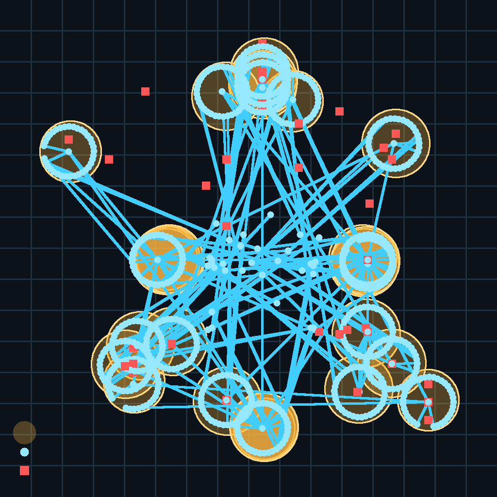

# Demo Pilot Validation Report

Validated: 2026-07-19
Branch: `codex/demo-pilot-validation`
Engine: Unity 6000.0.75f1, Windows Standalone, OpenXR

## Outcome

The current prototype is ready for a supervised desktop demonstration and a first physical-headset usability session. The automated validation passed the complete EditMode suite, produced a fresh Windows build, traversed all five training sites, and exported a 20-minute-equivalent spatial/inquiry analytics session.

This is an engineering pilot, not evidence of training efficacy, OSHA certification, or human-subject usability. A real learner and target headset are still required for comfort, accessibility, task-time, and transfer validation.

## Evidence summary

| Gate | Result | Evidence |
| --- | --- | --- |
| Unity EditMode tests | PASS | 124/124 passed; 0 failed |
| Windows build | PASS | 161.8 MB output; executable generated successfully |
| OpenXR project validation | PASS | 0 remaining Standalone validation issues |
| Meta Quest Android validation | PASS | 0 remaining validation issues; APK built successfully at 93.6 MB |
| Desktop startup stability | PASS | XR root, camera position, and camera rotation drift remained zero over the startup observation window |
| Five-site visual tour | PASS | Hub plus Construction, Warehouse, Fire Response, Chemical Processing, and Electrical Maintenance captured |
| Automated pilot duration | PASS | 1,200 simulated seconds, 240 seconds per site |
| Spatial analytics | PASS | 1,368 exported rows; 31 zones; 5 route summaries; map preview generated |
| Inquiry analytics | PASS | 41 events; 20 inspections; 31 evidence objects; 5 hypotheses; 5 final explanations |
| Hands-on coverage | PASS | 25 practical successes plus one controlled retry per site |

## Automated 20-minute pilot

The deterministic pilot opens the production scene and derives its route from the authored `SiteExperienceZone`, `SpatialAnalyticsZone`, `InspectionTarget`, `EvidenceObject`, and practical-action components. It does not use a separate mock map.

| Site | Simulated dwell | Zones | Inspections | Relevant evidence | Distractors | Practical attempts/successes | Path distance |
| --- | ---: | ---: | ---: | ---: | ---: | ---: | ---: |
| Construction | 240 s | 7 | 4 | 6 | 1 | 6 / 5 | 114.415 m |
| Warehouse | 240 s | 6 | 4 | 5 | 1 | 6 / 5 | 101.403 m |
| Fire Response | 240 s | 6 | 4 | 5 | 1 | 6 / 5 | 108.050 m |
| Chemical Processing | 240 s | 6 | 4 | 5 | 1 | 6 / 5 | 105.607 m |
| Electrical Maintenance | 240 s | 6 | 4 | 5 | 1 | 6 / 5 | 107.537 m |

The export contains raw JSONL plus analysis-ready CSV files for spatial samples, zone dwell, inquiry events, and learner route summaries. Conversation text and learner identity are not collected.

## OSHA alignment review

The scenario catalog separates actions a learner may take from conditions that require a competent person, qualified person, or employer program. HUD copy explicitly states that the experience is aligned training rather than a qualification or compliance certificate.

| Module | Current learning controls | Primary federal OSHA references reviewed | Readiness |
| --- | --- | --- | --- |
| Construction | Fall-edge control, guardrails, blocked access, material staging | [29 CFR 1926.501](https://www.osha.gov/laws-regs/regulations/standardnumber/1926/1926.501), [1926.502](https://www.osha.gov/laws-regs/regulations/standardnumber/1926/1926.502), [1926.250](https://www.osha.gov/laws-regs/regulations/standardnumber/1926/1926.250) | Aligned for awareness/inquiry training |
| Warehouse | Spill isolation, travel path, maintenance boundary, stable racking | [29 CFR 1926.250](https://www.osha.gov/laws-regs/regulations/standardnumber/1926/1926.250), [Hazard Communication 1910.1200](https://www.osha.gov/laws-regs/regulations/standardnumber/1910/1910.1200) as incorporated by 1926.59 | Aligned; site-specific spill procedure still required |
| Fire Response | Extinguisher access, equipment condition, clear egress | [29 CFR 1926.150](https://www.osha.gov/laws-regs/regulations/standardnumber/1926/1926.150) | Aligned for recognition; not firefighter qualification |
| Chemical Processing | Labels, SDS, compatibility, spill boundary, eyewash access | [Hazard Communication 1910.1200](https://www.osha.gov/laws-regs/regulations/standardnumber/1910/1910.1200) as incorporated by 1926.59 | Aligned; chemical/SDS details must match the host site |
| Electrical Maintenance | Treat-as-energized decision, isolation, tags, protected cable route | [29 CFR 1926.416](https://www.osha.gov/laws-regs/regulations/standardnumber/1926/1926.416), [1926.417](https://www.osha.gov/laws-regs/regulations/standardnumber/1926/1926.417) | Aligned with construction context and qualified-person escalation |

The electrical scenario intentionally uses construction rule 1926.417. General-industry 1910.147 excludes construction employment, so it is background context rather than the controlling citation for this module.

## Performance and XR readiness

- Standalone default quality was reduced from `Ultra` to `High`, removing the 150 m/four-cascade default shadow burden while retaining authored site lighting and props.
- Spatial sampling is throttled to 1 Hz. Site-zone evaluation is sampled rather than performed as a full-scene query every frame.
- NPC obstacle/visibility recovery is throttled and the five sites are isolated so only the selected module is presented during training.
- The current Windows build is 161.8 MB. Pilot screenshots are stored as optimized JPEG files; one compressed H.264 walkthrough is included.
- Standalone and Meta Quest Android OpenXR checks both report zero outstanding issues. The available validation machine had no connected OpenXR runtime/headset, so headset frame timing, reprojection, controller bindings, and motion comfort remain unmeasured.
- A lobby `DESKTOP / IVR` toggle selects desktop input or a running OpenXR headset. Without an active runtime, the Windows app returned to Desktop with the message `IVR unavailable: start Meta Quest Link/OpenXR or install the Quest APK.`
- Quest Android builds force IVR and use Meta Quest OpenXR support, ARM64, IL2CPP, API 29+, Touch controller profiles, and Vulkan/OpenGLES3. The production build completed at `Builds/MetaQuest/VR-Safety-Training-Quest.apk` (93,629,988 bytes).

## Human demo-pilot protocol

The next supervised session should use one novice learner and one observer on the target headset:

1. Record standing/seated preference, dominant hand, headset fit, and prior VR experience without collecting unnecessary identity data.
2. Complete the menu orientation and one task in each site without coaching unless the learner is blocked for 60 seconds.
3. Observe locomotion comfort, NPC legibility/occlusion, grab/release reliability, collision boundaries, and task interpretation.
4. Export the analytics session and compare observed confusion points against dwell, retries, evidence order, coach turns, and route backtracking.
5. Stop immediately for discomfort. Collect a short comfort/usability rating and a structured debrief.

Release to an unsupervised study should wait for physical-headset frame profiling, at least five formative learner sessions, accessibility review, and review by a qualified safety professional familiar with the host site's procedures and applicable state-plan rules.
